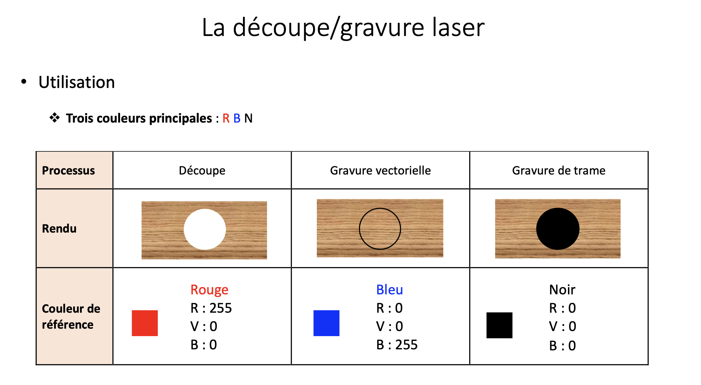

Infos sur la gravure et la découpe laser.

## Au centre de production de l'Eracom

**Polar Digicut** : c'est le premier découpeur laser de Polar, fabricant allemand surtout connu pour ses massicots.

Public cible : Imprimeurs, finition.  
Spécialité: Papier/carton, séries

Laser de 30W, plateau de 860 × 610 mm.  
Découpe laser: épaisseur maximum 3mm  
Gravure laser: épaisseur 6 à 10 mm  
Format planche: 80x60 cm

Instructions: [voir PDF](https://eracom.ch/extranet/wp/wp-content/documents/CentreProduction/05-CProd-Fiche_Technique-DCE_Decoupe_Laser-01_2026.pdf).

**Couleurs à utiliser:**

Lors de la réalisation du fichier : utiliser les 3 couleurs existantes dans le nuancier original d’Adobe Illustrator soit :

- **Coupe** -> **Noir**
- **Rainage demi-corps** -> <b style=color:#f00;>Rouge</b> CMJN
- **Gravure en surface** -> <b style=color:#f0f;>Magenta</b> CMJN

L’épaisseur donnée au contour doit être de : 0,01 mm

---

## Au FabLearn HEP

Voir les infos "[Découpe et gravure laser](https://fablearn.hepl.ch/project/decoupeuse-laser/)" sur le site du FabLearn.

En bref: trois machines à disposition:

**Trotec Speedy 100R**  
Dimensions du plateau : 610 x 305 mm  
Paramètres conseillés: Contreplaqué peuplier  
Épaisseur [mm] : 4 mm  
Puissance [% du max.] : 80  
Découpe laser: peut aller jusqu'à 6 mm  
Gravure laser: En cas de doute, un premier compromis pourrait être : Puissance [% du max.] : 60%, Vitesse [% du max.] : 25%.

Public cible: Makers, artisans, fablabs.  
Spécialité: Tous matériaux, pièces variées

**FLUX beamo**  
Dimensions du plateau : 300 x 210 mm

**VEVOR**  
Dimensions du plateau : 900 x 600 mm

Couleurs pour découpe Fablearn:

- **Découpe** -> <b style=color:#f00;>Rouge</b> (RVB)
- **Gravure vectorielle** -> <b style=color:#00f;>Bleu</b> (RVB) 
- **Gravure de trame** -> **Noir** (RVB)

## Quelle machine pour quel usage ?

* Si votre usage est la gravure/découpe bois et matériaux variés, la **Trotec Speedy 100R** est bien plus adaptée. 
* Le **Digicut** est davantage taillé pour la finition d'imprimés en série.

## Type de bois recommandé

**Contreplaqué peuplier** 600 x 600 x 4mm [chez Jumbo.ch](https://www.jumbo.ch/fr/construction-renovation/bois/bois-de-construction-bois-profile/planches/contreplaque-peuplier-600-x-600-x-4mm/p/6231570?tt=X1NFUF9mMzZhZGFkYjcxNDRmZjg3NTRhOWFiYzM5ZDk1Yjg1Y19QT1NfMQ==#modal).  
Prix par planche: CHF 6.95