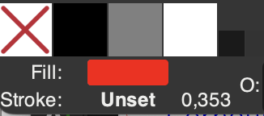
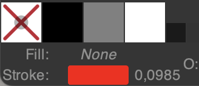
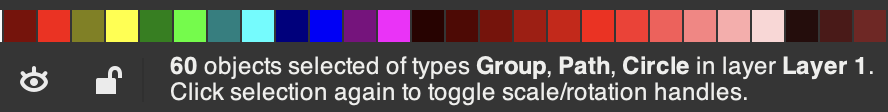
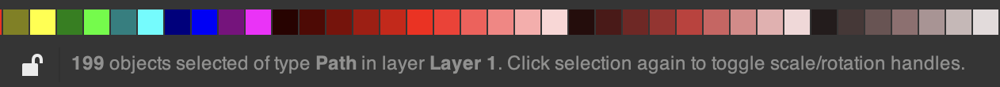

## Préparation des fichiers SVG pour Trotec

Pour que le fichier SVG soit bien lu par la machine Trotec, voici des conseils de préparation (à effectuer dans Inkscape):

### Vérifier Fill et Stroke.

- Les éléments pour découpe: doivent avoir un **contour** (*Stroke*) de couleur rouge, et pas de remplissage (*Fill*).
- Les éléments à graver: doivent avoir du remplissage (*Fill*), mais pas de contour (*Stroke*). 
- Epaisseur des tracés (Stroke): en général, mettre 0.1 mm.

**Astuce:** en ayant un élément sélectionné, l'indicateur dans le coin inférieur gauche montre les valeurs de *Fill* et *Stroke*.

❌ Exemple problématique: cet élément a un *Fill* (rouge) et un *Stroke* (sans couleur mais présent).

✅ Exemple correct: cet élément n'a pas de *Fill*, seulement un *Stroke* (rouge).

### Défaire groupes et objets

**Défaire les groupes**

Pour cela, on peut *tout sélectionner* (cmd-A), et faire *Object > Ungroup*. Répéter si nécessaire, jusqu'à ce qu'il ne reste plus de groupes. 

**Convertir les objets en tracés (*Paths*)**

Les **objets géométriques**, tels que les cercles ou rectangles, doivent être convertis en tracés (*Paths*).

Pour cela, faire *Path > Object to Path*.

**Astuce 1:** pour sélectionner tous les objets d'un même type (tels que les cercles), faire *Edit > Select Same > Object Type*.

**Astuce 2:** le bas du canevas contient un message indiquant si les éléments sélectionnés comportent des groupes. 

❌ Dans cet exemple, il y a un problème car la sélection comporte des *Groupes* et *Cercles*. On aimerait n'avoir que des *Paths*.

✅ Exemple correct: il n'y a que des *Paths*.

---

