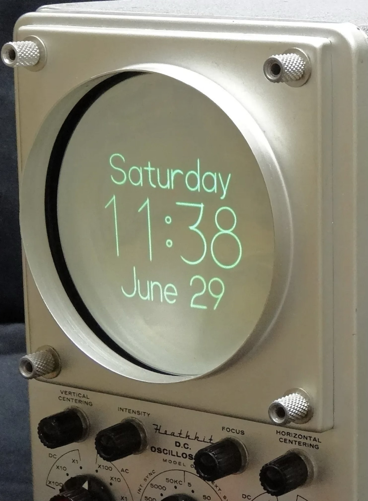
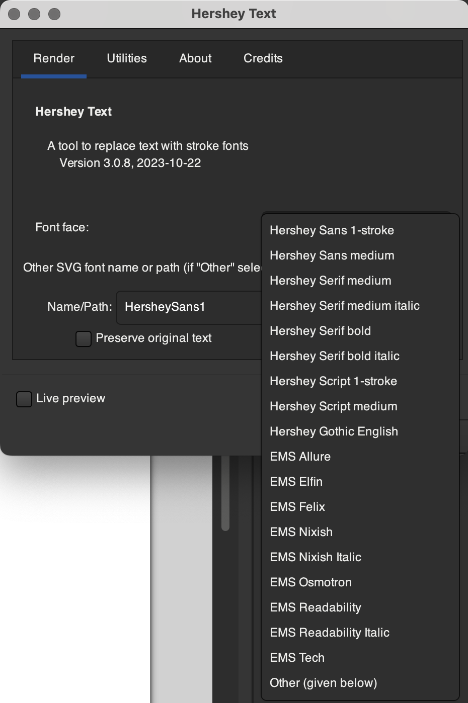
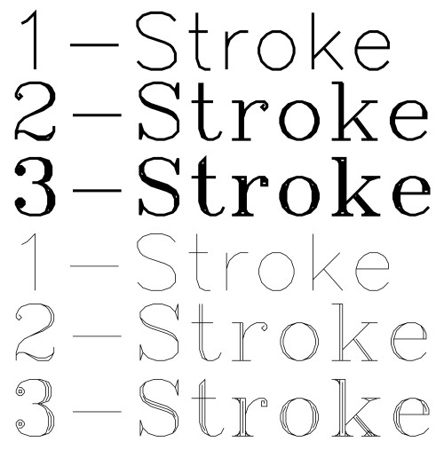
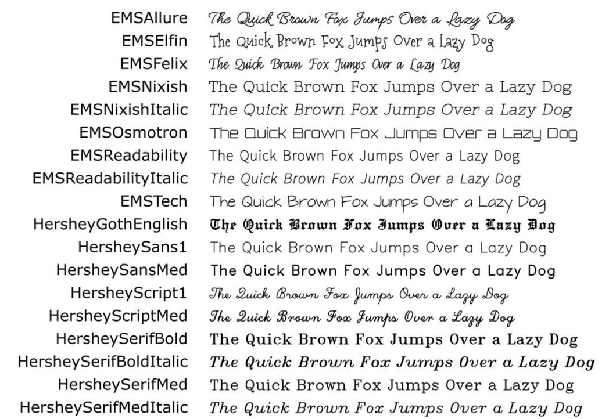
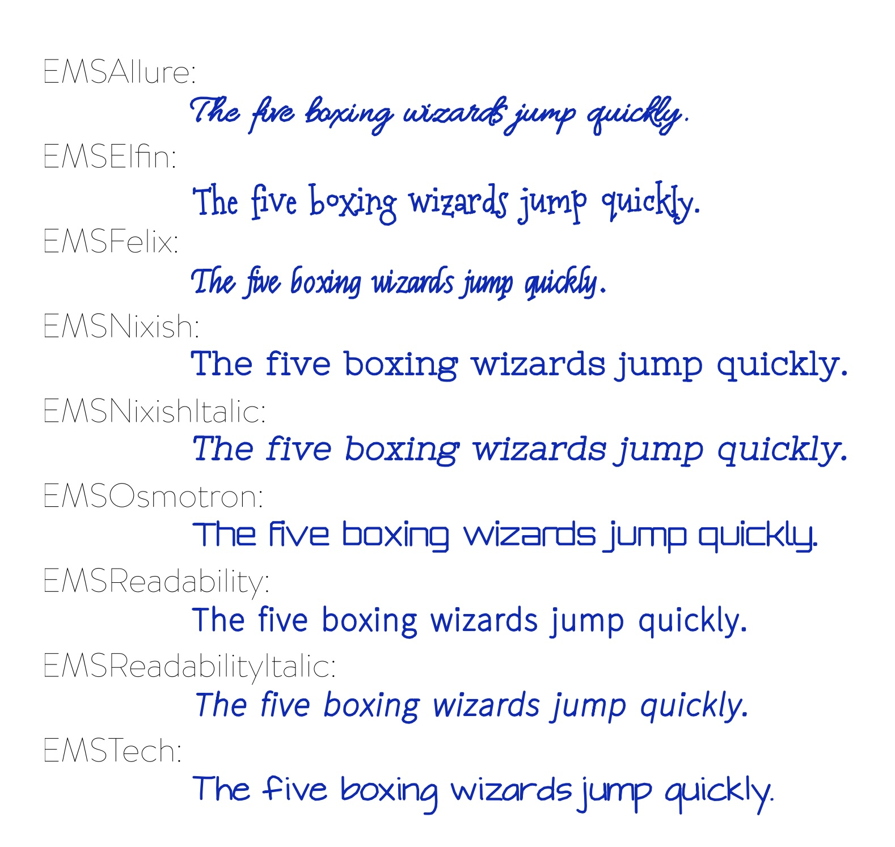
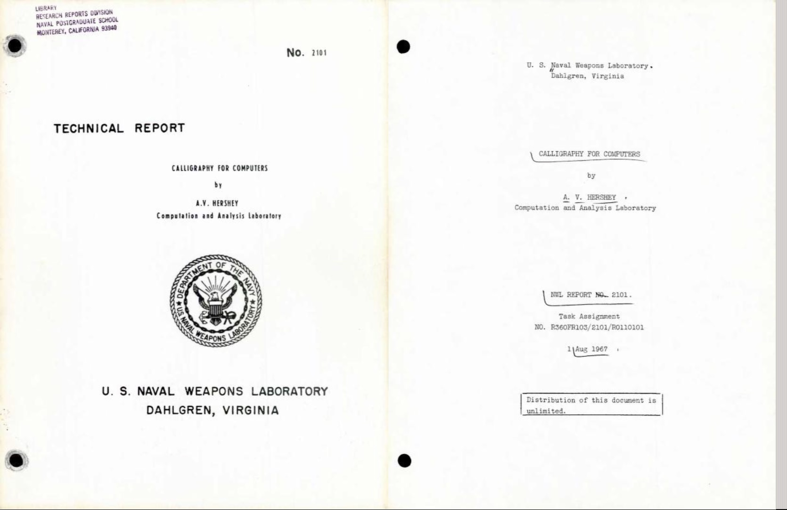
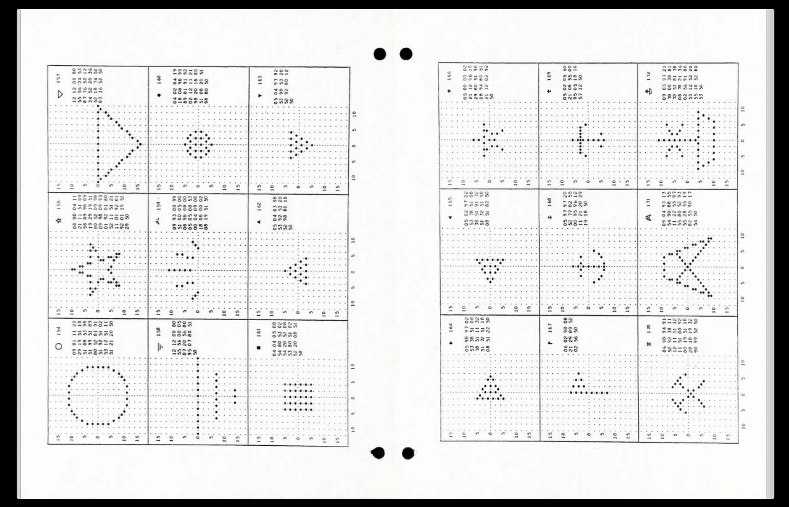

## Les Hershey Fonts

Les "Hershey fonts" sont une collection de fontes vectorielles développées en 1967 environ par Dr. Allen Vincent Hershey, dans le Naval Weapons Laboratory de l'armée américaine. Ces fontes étaient à l'origine destinées à l'affichage sur des tubes cathodiques.

Par la suite, elles ont été utilisées comme fontes pouvant être tracées sur des circuits imprimés.

Elles sont aujourd'hui utiles pour les *Pen Plotters* et la gravure laser. On nomme ce type de fontes "engraving fonts" ou "stroke fonts".

-> [Info sur Wikipédia](https://en.wikipedia.org/wiki/Hershey_fonts)

## Hershey Fonts dans Inkscape

Le logiciel Inskscape comporte une extension "Hershey Fonts" qui est développée par Windell H. Oskay (Evil Mad Scientist), créateur de l'AxiDraw. [Documentation](https://wiki.evilmadscientist.com/Hershey_Text).

Cela se trouve sous **Extensions > Text > Hershey Text**

Les épaisseurs: les Hershey Fonts ont trois épaisseurs:

1. “Simplex” 
2. “Duplex”
3. “Triplex” 

Dans Inkscape, elles ont été nommées “1-stroke”, “medium” et “bold”.

Windell H. Oskay a également ajouté dans cette extension une série de Stroke fonts nommées EMS qui sont dérivées de diverses fontes open source.

### Code

#### Hershey Text for Inkscape

[Hershey Text for Inkscape sur Gitlab](https://gitlab.com/oskay/hershey-text), par Windell H. Oskay, Evil Mad Scientist Laboratories (EMSL).

#### Hershey Text JS

[Hershey Text JS](https://github.com/techninja/hersheytextjs) par techninja (James Todd). "A port of the EMSL Hershey engraving font data from the Hershey Text Inkscape Plugin to JSON, capable of being rendered quickly via JavaScript & SVG".  
[Site web démo](https://techninja.github.io/hersheytextjs/).

#### Versions TTF / OTF par Luuse

[Hershey Noailles](http://hershey-noailles.luuse.io/www/) par le collectif de graphisme Luuse pour la Villa Noailles (2017) - "We forked hersheytextjs and made it a program that defines strokes in css, then exports it as a font".  Une autre fonte dérivée des Hershey Fonts est [Hershey-ArkDes](https://luuse.io/projects/arkdes-hershey/) (2024). Ces fontes sont pensées pour une utilisation en print, ce ne sont pas des "stroke fonts", mais des fontes TrueType ou OpenType. Dossiers de téléchargement: [Hershey Noailles](https://gitlab.com/Luuse/foundry/fonts.luuse/-/tree/main/fonts/Hershey-Noailles?ref_type=heads), [Hershey-ArkDes](https://gitlab.com/Luuse/foundry/hershey-ad).

## Ressources

[Annonce sur les Hershey Fonts dans Inkscape](https://www.evilmadscientist.com/2011/hershey-text-an-inkscape-extension-for-engraving-fonts/), par Windell H. Oskay, Evil Mad Scientist Laboratories, 2011.

### Recherches de Frank Grießhammer

En 2015, Frank Grießhammer, type designer travaillant chez Adobe, a fait une recherche approfondie sur les Hershey Fonts.

**[Cogitating Vectors: The Hershey Fonts](https://lapolice.ch/stories/footnotes-b-article-9/)** - Un article approfondi par Frank Grießhammer, dans le magazine *La Police*, Footnotes B, 2017.

**[The Hershey Fonts with Frank Griesshammer](https://vimeo.com/178015110)**, présentation vidéo donnée en 2016, sur ses recherches concernant les Hershey Fonts.

<iframe title="vimeo-player" src="https://player.vimeo.com/video/178015110?h=18610a851b" width="100%" height="360" frameborder="0" referrerpolicy="strict-origin-when-cross-origin" allow="autoplay; fullscreen; picture-in-picture; clipboard-write; encrypted-media; web-share"   allowfullscreen></iframe>

---

### Travaux de A. V. Hershey

*[Calligraphy for Computers](https://archive.org/details/hershey-calligraphy_for_computers)*, ouvrage de A. V. Hershey publié en 1967, sur Archive.org

